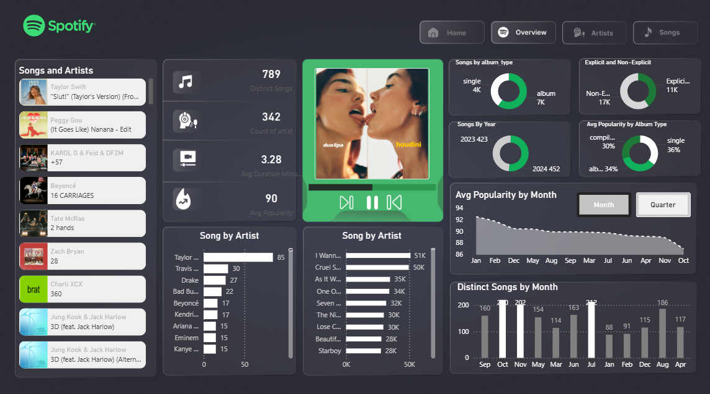
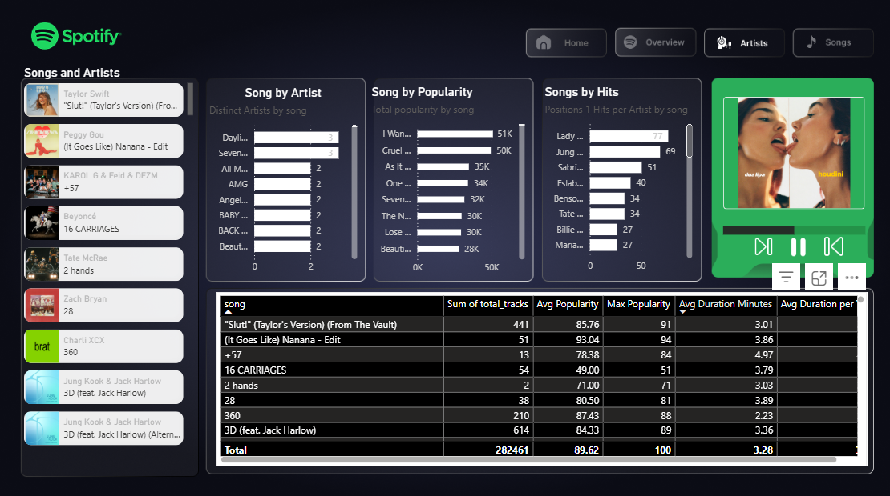

### **Power BI Project: Spotify Global Performance Dashboard**

This Power BI project provides a comprehensive analysis of Spotify’s "Top 50" global datasets, transforming raw streaming rankings into actionable insights for music analysts and marketing teams. The dashboard evaluates song performance, artist reach, and listener trends across multiple dimensions.

---

### **📊 Project Highlights**

* **Multi-Layered Performance Tracking:** A specialized three-page report structure (Overview, Artist Insights, and Song Deep-Dives) to facilitate both macro-trend analysis and granular data exploration.
* **Content & Distribution Profiling:** Detailed breakdown of **Explicit vs. Non-Explicit** content shares and **Album Type** distributions (Single, Album, Compilation).

* **Interactive UX/UI:**
    * **Drill-Down Navigation:** Seamless transitions from high-level KPIs to specific artist and track performance.
    * **Figma-Prototyped Design:** A modern, dark-themed interface mirroring the Spotify brand identity to ensure a familiar and intuitive user experience.

--

### **🎯 Purpose**

This project was developed to bridge the gap between raw ranking data and strategic decision-making:
* **Trend Identification:** To visualize how global music tastes evolve over time and identify peak engagement periods.
* **Technical Mastery:** To implement sophisticated DAX formulas for popularity averaging and to apply UX best practices in dashboard layout and storytelling.

---

### **📌 Business Requirement**

Spotify stakeholders—including playlist curators and marketing managers—require a centralized tool to monitor the "Top 50" ecosystem. Key requirements addressed include:

* **Executive Overview:** Instant visibility into **Total Songs, Distinct Artists, Average Popularity,** and **Average Track Duration**.
  
 

* **Artist Analytics:** Identification of top-tier talent based on popularity scores and the ability to drill down into an artist's specific release history and chart positions.
  
 

* **Trend Analysis:** Monthly and yearly views of average popularity to assist in timing marketing campaigns or new releases.

---

### **📌 Problem Statement**

Before this solution, Spotify’s raw datasets existed as static lists, making it difficult for teams to identify overarching patterns. This dashboard solves the following:

* **Fragmented Data:** Consolidates disconnected lists into a unified view of KPIs.
* **Content Blind Spots:** Provides clarity on the performance of explicit content and album types that was previously buried in the rows.
* **Lack of Historical Context:** Enables stakeholders to see if an artist's popularity is rising or falling over a specific timeframe.
* **Decision Gaps:** Empowers curation teams to move beyond "gut feeling" by identifying which artists consistently hold #1 positions and which genres/types are currently resonating with global audiences.
